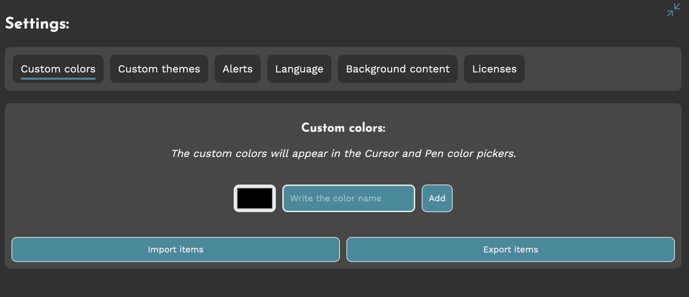

# pdf-pointer

Display PDFs with a pointer, make quick annotations (that automatically
disappear), zoom them, and export everything as an image Try it:
https://dinoosauro.github.io/pdf-pointer/

## Open a file

### From the website

When you open the website, you'll be prompted to open a website. Click on the
button and select one of it.

### From the file picker

If you've installed PDFPointer as a Progressive Web App, you can open PDF files
directly from your device's file picker. Right-click the file you want to open,
and select "PDFPointer" from the "Open with" menu. You _could_ also make
PDFPointer the default application for opening PDF files, but honestly neither I
would do that.

## Functionaly

You can access to all functionalities of PDFPointer from the Toolbar

### Previous and next page

The first and the last button permit to change the page. Simple as that.

### Zoom in and out

These buttons permits to change the zoom size. Currently, zoom is
increased/decreased by 0.2

### Show thumbnails

PDFs can have lots of pages. To quickly navigate them, click on the "Show
thumbnails" button to show a preview of each page. Click on each preview to
change page.

### Pen

Create a pen annotation. By clicking it, the pen controls will be shown:

2. Change the annotation timer
3. Change the size of the annotation
4. Change the opacity of the annotation
5. Change the color of the annotation
6. Enable eraser

### Pointer

Change settings about the pointer. By clicking it, the pointer controls will be
shown:

2. Change pointer color
3. Change pointer size

### Eraser

Erase both text and pen annotations, by pressing on the part of the canvas to
delete.

### Text

Write text on the PDF. By clicking it, the text controls will be shown:

2. Change the text delete timer
3. Change text size
4. Change text color
5. Change text font family
6. Enable/disable bold text
7. Enable/disable italic text
8. Enable/disable underlined text
9. Enable/disable striked text
10. Change underlined/striked bar height
11. Change line spacing
12. Enable eraser mode

### Fullscreen mode

Enable fullscreen mode. If zooms weren't made, the PDF will be adapted to the
screen'size. Otherwise, the zoom size will be adapted to the screen's size
compared to the default (PDF scale)

### PDF Filters

You can add some filters to the PDF to made it easier to read at night. The
filters, adjustable with a slider, are:

- Negative
- Hue inversion
- Sepia
- Grayscale

### Export PDF as image

You can also export the PDF as an array of images. In the new exportation
dropdown, you can specify the number of page to export, the format (and the
quality for lossy formats) and the output screen size.

It's also possible to export all the annotations, applying also the current PDF
filters.

If selected, the PDF images will be exported in a PDF file. Otherwise, if the
browser supports it, the File System API will be used to get direct access to
the output folder, otherwise file will be downloaded as Blob links.

### Settings

Open the settings dialog.

## Settings

PDFPointer permits to change basically everything about its usage. In the
settings, you can edit:

### Custom color

The new custom colors will appear in the "Fill" dropdowns for pen/text/pointer
colors.

### Custom theme

Manage, apply, create or delete themes.

You can edit each color by clicking on the respective color. Scroll to the right
to see every value, and, at the end of this list, you'll find a button to save
the theme. There are basically no limits to the number of themes you can have.

_Actually, there are: 10^16 themes, or 5MB in the LocalStorage (including other
settings)_

### Alerts

Alerts are some text information that appear at the top of the screen. You can
choose to disable them completely, or to hide only some of them. You can also
change the length they are visible.

### Language

Change the language used by PDFPointer. Currently, only Italian and English are
supported.

### Background content

You can customize the backgroud content by putting a classic color, an image or
a video (both from local files and from YouTube).

_An example of the UI with a custom background can be found at the top of this
README_

### Keyboard shortcuts

You can add keyboard shortcuts for:

- Zoom in
- Zoom out
- Enable/disable pen
- Change pointer
- Write text
- Enable/disable eraser
- Stop every option
- Enable/disable thumbnail view
- Enable/disable fullscreen
- Show settings
- Go to next page
- Go to previous page
- Export as an image

### Licenses

Show open source licenses

## Progressive Web App

You can install PDFPointer as a Progressive Web App for a better experience.
You'll also be able to open PDF files directly from the file picker, and you'll
be able to use the website completely offline.

## Privacy

Your PDFs stays always on your device. The only external connections made by
PDFPointer are to Google Fonts' servers (and YouTube if you enable a YouTube
video for background content), but no data is shared with them.
